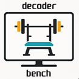

# Decoder bench

  

## What this is

Native decoder benchmark for rooted LG webOS TVs.

## But why?

While experimenting with Moonlight/Sunshine streaming on my LG C2 TV, I found that it could not [go over ~65 Mbps](https://github.com/mariotaku/moonlight-tv/wiki/FAQs#can-i-have-higher-framerate-than-65mbps-on-webos)
.
I got curious about the actual limits and built this: a native webOS app that stress-tests the video decoder pipeline.

Result? It turns out, C2 can decode 4K@60 at 220 Mbps, so the 65 Mbps cap has nothing to do with the decoder.

## Usage

Install it and launch it - the app will go through the bundled test suite.
On rooted TVs download the extended benchmark suite from releases and unpack it to a USB stick. The app will run tests from there on launch and save benchmark results (CSV files) and logs there.

You can also run the app via the SSH/Telnet CLI.

## Read next

- [docs/README.md](docs/README.md) for the complete documentation map.
